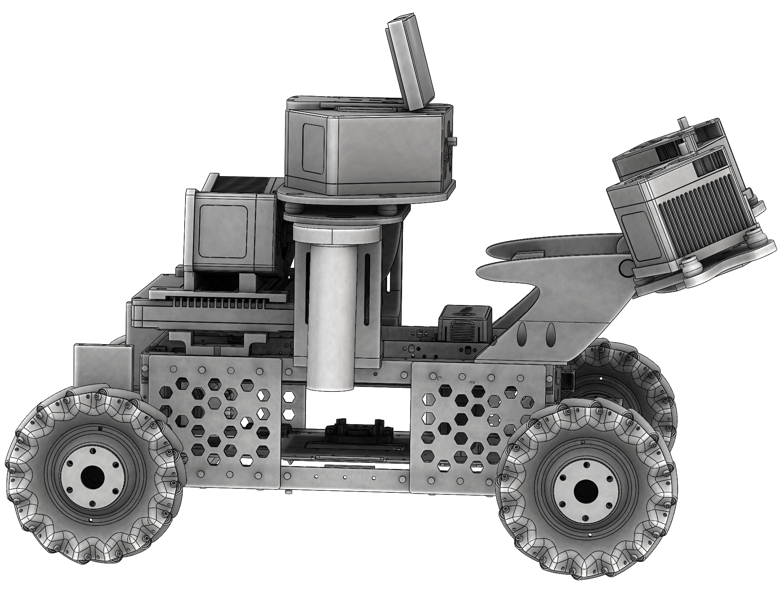
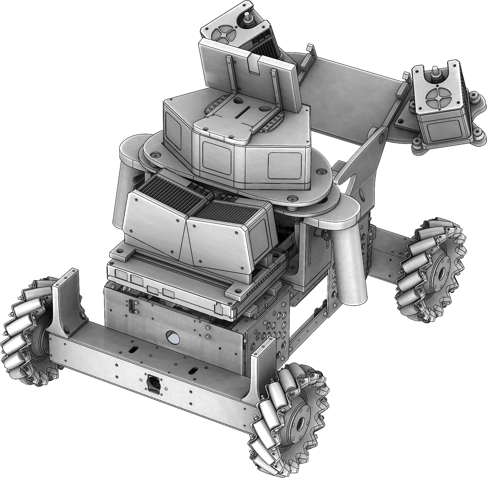
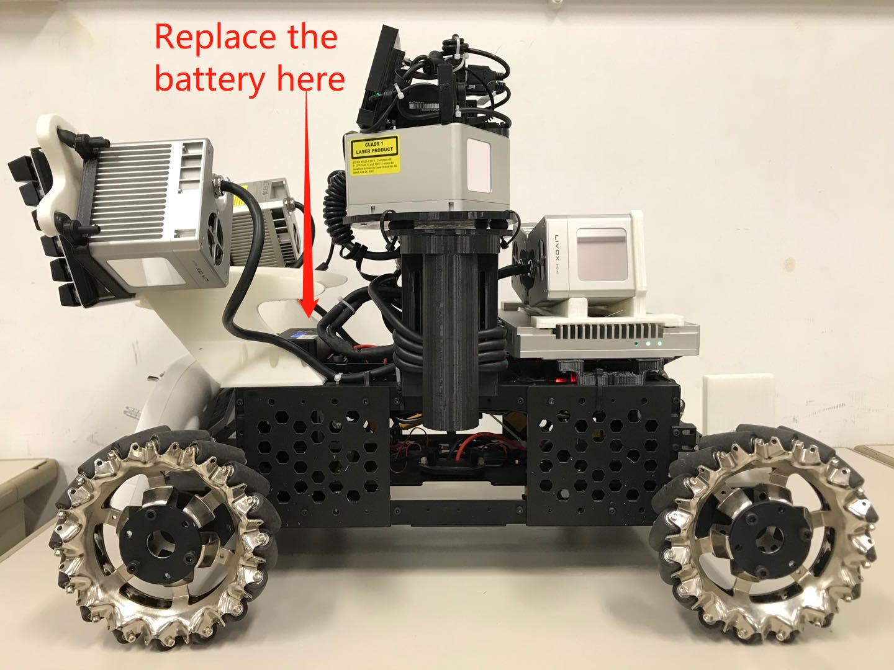
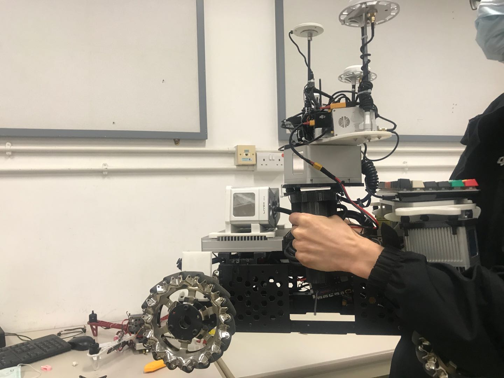
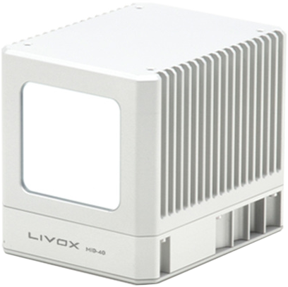
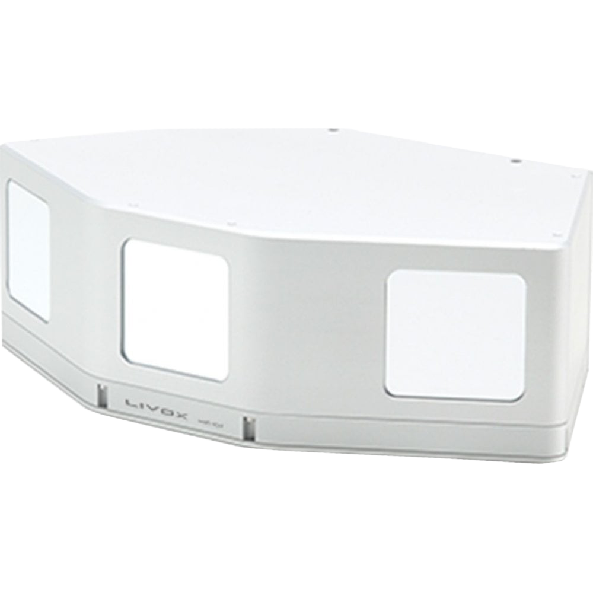

# UGV_LiDAR_platform
##  A cost-efficiency UGV platform with multiple LiDARs

    

  

**UGV_LiDAR_platform** is an open soure hardware project of a cost-efficiency UGV platform, which mounts a [Livox Mid-100](https://www.livoxtech.com/mid-40-and-mid-100) and 4 [Livox Mid-40](https://www.livoxtech.com/mid-40-and-mid-100) LiDARs. All of the modules in this project are capable of [*FDM (Fused Deposition Modeling)*](https://en.wikipedia.org/wiki/Fused_filament_fabrication) printable.  Our project includes all of the source files ([*Solidworks*](https://www.solidworks.com) files, with suffix “\*.SLDPRT; \*.SLDASM”) and commonly 3D (STL) files (under the “release” directory), from which our users can reproduce our works easily.

**Designer**: [Jiarong Lin](https://github.com/ziv-lin)

    

  

    <a href="https://github.com/hku-mars/lidar_car_platfrom" target="_blank">
    <a href="https://github.com/hku-mars/lidar_car_platfrom" target="_blank">
    <a href="https://github.com/hku-mars/lidar_car_platfrom" target="_blank">
    <a href="https://github.com/hku-mars/lidar_car_platfrom" target="_blank">

    
    
    
    

## Assembly instructions

If you have installed [*Solidworks*](https://www.solidworks.com) on your computer, we strongly recommand you to see more details by openning the assembly file [**car_assemble.SLDASM**](./car_assemble.SLDASM).

## Material lists (only for reference)
| Item  | Pics  | Shopping link (available  is not guaranteed)  |
| :------------: | :------------: | :------------: |
| Livox Mid-40  |   | [official website](https://www.livoxtech.com/mid-40-and-mid-100); [DJI](https://store.dji.com/cn/product/livox-mid?vid=48991) |
| Livox Mid-100  |   | [official website](https://www.livoxtech.com/mid-40-and-mid-100); [DJI](https://store.dji.com/cn/product/livox-mid?vid=48991) |
| UGV Chassis  |   | [Link](https://www.robomaster.com/zh-CN/products/components/detail/1839)
| Livox Hub (**optional**)  |   | [official website](https://www.livoxtech.com/hub); [DJI](https://store.dji.com/zh-tw/product/livox-hub) |

## License
The source code is released under [GPLv2](http://www.gnu.org/licenses/) license. 

For any technical issues, please contact me via email Jiarong Lin < ziv.lin.ljr@gmail.com > 

For commercial use, please contact Dr. Fu Zhang < fuzhang@hku.hk >
